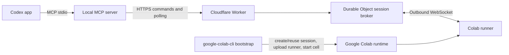

# codex-colab-bridge

`codex-colab-bridge` connects the Codex app to a Google Colab runtime through a
local MCP server, a Cloudflare Worker/Durable Object, and an outbound runner
process in Colab.

> Security warning: this project enables remote code execution in your Colab VM.
> Any enabled shell, Python, file-write, or job-control tool can run code with
> the permissions of that Colab runtime. Treat controller and runner tokens as
> secrets, use a low-risk Colab account, and do not expose credentials or mounted
> drives that you would not trust the remote commands to access.

This is not a Google project and is not affiliated with Google, Google Colab, or
Google's `colab-mcp` project. It uses Google Colab as the remote runtime and can
use `google-colab-cli` for bootstrap.

## Quickstart From Zero

Prerequisites:

- Node.js 20 or newer
- A Cloudflare account authenticated with Wrangler. `npm install` installs the
  project-pinned Wrangler CLI used by setup.
- `uvx` for running `google-colab-cli` on macOS or Linux
- A Colab account/session that you control
- The Codex CLI/app for plugin installation

After cloning the repo, install and test it:

```bash
cd codex-colab-bridge
npm install
npm test
npm run package:plugin
```

`package:plugin` creates the clean Codex plugin payload in
`plugins/codex-colab-bridge`. The Codex app installs that small payload, not the
whole source checkout.

Authenticate Cloudflare before setup:

```bash
npx wrangler login
```

`google-colab-cli` has no separate `login` command. The first Colab operation may
open a browser OAuth flow. You can do a quick CLI sanity check with:

```bash
uvx --from google-colab-cli colab sessions
```

Preview the deploy/bootstrap plan. The dry run prints no secrets and does not
touch Cloudflare or Colab:

```bash
npm run setup:all -- --dry-run
```

Run the guided setup in the safer default mode:

```bash
npm run setup:all -- --smoke
```

`setup:all` checks local prerequisites, writes Cloudflare Worker secrets, deploys
the Worker, creates a bridge session, writes
`~/.config/codex-colab-bridge/config.json`, bootstraps a Colab T4 session named
`codex-colab-bridge`, and runs the MCP smoke test when `--smoke` is set. It
generates an admin secret when one is not provided and never prints admin,
controller, or runner token values.

By default, setup writes the Worker dangerous-tools policy as disabled. This
allows status, GPU status, read-file, and tail-job tools, but blocks remote
shell, Python execution, file writes, job starts, and job interrupts.

For a stable admin secret across repeated setup commands, set it in the
environment instead of passing it on an npm command line:

```bash
export COLAB_MCP_BRIDGE_ADMIN_SECRET=<admin-secret>
npm run setup:all -- --smoke
```

Enable remote shell/Python/file-write/job-control tools only when you trust the
Colab runtime and anything mounted inside it:

```bash
npm run setup:all -- --enable-dangerous-tools --smoke
```

To change the Colab accelerator after setup, recreate the runtime. This stops
the named Colab session, creates a fresh bridge session, bootstraps the runner
with the requested accelerator, and writes new local MCP config:

```bash
npm run runtime:recreate -- --gpu L4 --yes --smoke
```

Use `--gpu none` for CPU. Active Colab processes and runner-owned job/log state
are lost when the runtime is recreated.

After setup writes the local MCP config, install this checkout into the Codex
app:

```bash
codex plugin marketplace add .
codex plugin add codex-colab-bridge@codex-colab-bridge
```

Start a new Codex thread after installing so the app loads the plugin skill and
MCP server. The plugin reads the local config written by setup.

Create editable local config templates only when you want manual setup:

```bash
cp .env.example .env
cp config.example.json config.local.json
```

## Codex App Plugin

This repository is also a Codex plugin marketplace. For a local checkout, run:

```bash
npm run package:plugin
codex plugin marketplace add /absolute/path/to/codex-colab-bridge
codex plugin add codex-colab-bridge@codex-colab-bridge
```

For a published GitHub repo, use the repository source instead:

```bash
codex plugin marketplace add https://github.com/<owner>/codex-colab-bridge
codex plugin add codex-colab-bridge@codex-colab-bridge
```

The plugin contributes the local MCP server and a usage skill. The bridge still
requires the Cloudflare Worker and Colab runner setup described above; installing
the plugin does not deploy infrastructure or create tokens.

Run diagnostics:

```bash
npm run doctor -- \
  --config ~/.config/codex-colab-bridge/config.json \
  --require-network
```

Smoke test the Codex-facing MCP path:

```bash
npm run smoke:mcp
npm run smoke:mcp -- --dangerous
```

Use the `--dangerous` smoke only after you intentionally enabled dangerous tools
locally and in the Worker environment.

## Architecture



Provisioning is separate from control. `google-colab-cli` creates or reuses the
Colab runtime, installs dependencies, uploads the runner, and starts it. After
that bootstrap step, MCP tools control the already-live runtime through the
bridge.

## Threat Model

What the bridge tries to protect:

- Unauthenticated parties should not be able to control a runner.
- Controller and runner tokens should not be printed in normal setup output.
- Dedicated file tools should stay under the configured project root.
- Logs, files, and command output should be bounded before crossing Cloudflare
  or MCP.
- Expired or revoked sessions should stop accepting controller and runner
  traffic.

What the bridge does not protect:

- Enabled shell/Python tools are remote code execution and can read Colab
  environment variables, mounted Drive files, local notebook files, network
  credentials, and any other runtime-accessible data.
- File-tool path restrictions do not sandbox arbitrary shell commands.
- Log redaction can reduce accidental leakage, but cannot stop malicious code
  from printing or exfiltrating secrets.
- Cloudflare coordinates control traffic; it is not a private artifact store.
- Google controls Colab VM lifetime, GPU availability, idle policy, and runtime
  duration.

Operator responsibilities:

- Protect all admin, controller, runner, API, cloud, notebook, and model-registry
  tokens.
- Use short-lived or low-privilege tokens where practical.
- Avoid mounting Google Drive unless the active commands need it.
- Use a low-risk Colab account for experiments.
- Revoke sessions and rotate secrets after suspicious activity.

## Limitations

- Colab jobs do not survive VM deletion or runtime reset.
- Live job state and logs are runner-owned. If the runner process dies, the
  bridge can only report the last known durable state.
- Large artifacts, datasets, checkpoints, package caches, and full training
  outputs must not go through Cloudflare.
- GPU type, GPU availability, idle timeout, and maximum runtime duration are not
  guaranteed.
- Users control and protect all tokens. The bridge cannot recover or secure a
  token once exposed to code running in the Colab runtime.
- The current implementation supports one active background job per session.

Use `google-colab-cli upload` / `download` or external storage such as Google
Drive, Google Cloud Storage, Hugging Face Hub, Cloudflare R2, or GitHub Releases
for large artifacts.

For Python model jobs, the runner sets `PYTHONUNBUFFERED=1` for child processes
and runs direct `colab_run_python` snippets with `python -u`. If a framework or
custom launcher still delays logs, use explicit `python -u ...` commands or
`print(..., flush=True)` at important progress points.

## Local Setup And Doctor

Create a bridge session and write local MCP config:

```bash
export COLAB_MCP_BRIDGE_BASE_URL=https://<worker-name>.<cloudflare-subdomain>.workers.dev
export COLAB_MCP_BRIDGE_ADMIN_SECRET=<admin-secret>

npm run setup:bridge -- --config ~/.config/codex-colab-bridge/config.json
```

Check local prerequisites and config shape:

```bash
npm run doctor -- --config ~/.config/codex-colab-bridge/config.json
npm run doctor -- --config ~/.config/codex-colab-bridge/config.json --skip-network
```

The doctor checks Node, installed package files, `uvx`, `google-colab-cli`,
`wrangler`, local MCP config, Worker `/health` when a URL is configured, and
authenticated bridge status when the local controller token exists.

If a Worker deploy disconnects a runner that was started by this repo's
bootstrap script, reconnect it without creating a new bridge session:

```bash
uvx --from google-colab-cli colab exec -s <colab-session-name> -f scripts/colab-reconnect-runner.py
```

The reconnect helper reads the bridge environment from the existing Colab runner
process, restarts the runner, and prints only redacted token status.

## Bootstrap A Colab Runtime

The primary bootstrap flow uses PyPI's `google-colab-cli` through `uvx`. Create a
bridge session through the Worker first, then export the values needed by the
Colab runner. The runner token is only for the Colab-side runner; the controller
token is optional here and is used only for status polling.

```bash
export COLAB_MCP_BRIDGE_BASE_URL=https://<worker-url>
export COLAB_MCP_BRIDGE_SESSION_ID=<session-id>
export COLAB_MCP_BRIDGE_RUNNER_TOKEN=<runner-token>
export COLAB_MCP_BRIDGE_CONTROLLER_TOKEN=<controller-token>

npm run bootstrap:colab -- --colab-session <colab-session-name> --gpu T4
```

The bootstrap script shells out to:

```bash
uvx --from google-colab-cli colab ...
```

It checks for a named Colab session, creates one if needed, requests a T4 GPU by
default, installs `websockets`, creates `/content/project`, uploads
`python/colab_runner.py`, uploads a temporary runner config file, and starts the
runner in the Colab runtime with `COLAB_BRIDGE_URL`,
`COLAB_BRIDGE_SESSION_ID`, and `COLAB_BRIDGE_RUNNER_TOKEN` set. It also sets
`COLAB_BRIDGE_PROJECT_ROOT` so the runner uses the requested project root.

Useful options:

```bash
npm run bootstrap:colab -- --dry-run
npm run bootstrap:colab -- --colab-session <colab-session-name> --gpu T4
npm run bootstrap:colab -- --project-root /content/project --runner-path python/colab_runner.py
npm run bootstrap:colab -- --bridge-config ./config.local.json
```

The explicit bootstrap config can contain `base_url` or `worker_url`,
`session_id`, `runner_token`, and optional `controller_token`,
`colab_session`, `project_root`, `runner_path`, `remote_runner_path`,
`remote_config_path`, `gpu`, and `colab_config`. The script does not create or
modify local user config.

Changing GPU type is not a live runner setting. Use:

```bash
npm run runtime:recreate -- --gpu T4 --yes --smoke
```

The recreate command wraps the safe provisioning sequence: `google-colab-cli
stop`, fresh bridge session creation, Colab bootstrap, local config rewrite, and
optional MCP smoke testing.

If `google-colab-cli` is not available or cannot authenticate, the fallback is a
manual Colab notebook bootstrap:

```python
%pip install websockets
from pathlib import Path
import os

Path("/content/project").mkdir(parents=True, exist_ok=True)
os.environ["COLAB_BRIDGE_URL"] = "https://<worker-url>"
os.environ["COLAB_BRIDGE_SESSION_ID"] = "<session-id>"
os.environ["COLAB_BRIDGE_RUNNER_TOKEN"] = "<runner-token>"
os.environ["COLAB_BRIDGE_PROJECT_ROOT"] = "/content/project"

# Upload python/colab_runner.py to /content/project/colab_runner.py first.
%run /content/project/colab_runner.py
```

## Local MCP Server

Build the TypeScript output, then run the local stdio JSON-RPC MCP server:

```bash
npm run build
COLAB_MCP_BRIDGE_BASE_URL=https://<worker-url> \
COLAB_MCP_BRIDGE_SESSION_ID=<session-id> \
COLAB_MCP_BRIDGE_CONTROLLER_TOKEN=<controller-token> \
node dist/src/mcp-server.js
```

`COLAB_MCP_BRIDGE_WORKER_URL` can be used instead of
`COLAB_MCP_BRIDGE_BASE_URL`. The same values can also be loaded from a JSON
config file with `base_url` or `worker_url`, `session_id`, and
`controller_token`.

Dangerous foreground execution, file writes, and background job control are
disabled unless explicitly enabled in local policy. To allow `colab_run_shell`,
`colab_run_python`, `colab_write_file`, `colab_start_job`, and
`colab_interrupt_job`, set:

```bash
COLAB_MCP_BRIDGE_ENABLE_DANGEROUS_TOOLS=1
```

or add `"enable_dangerous_tools": true` / `"enableDangerousTools": true` to the
local config file. The Worker/HTTP handler must also be started with the same
explicit enablement. Without this, dangerous tools return `TOOL_DISABLED`.
`read_file` and `tail_job` are read-only and enabled by default, but the runner
still enforces project-root path and size/log limits.

## Cloudflare Worker

The Worker-shaped entrypoint is `src/worker.ts`. It exports the default `fetch`
handler plus `ColabBridgeSessionDurableObject` for the current HTTP bridge
routes. Tests call the Worker with plain Node `Request`/`Response` objects and a
mocked env:

```ts
await worker.fetch(request, { ADMIN_SECRET: "test_admin_secret" });
```

`wrangler.toml` defines the Durable Object binding and deliberately does not
contain secrets. The default deploy target uses `workers.dev` and disables
Cloudflare preview URLs explicitly. Configure deployment secrets outside source
control:

```bash
npx wrangler secret put ADMIN_SECRET
```

## Maintainer Validation

Smoke a fresh local clone/copy without deploying live infrastructure:

```bash
tmp=$(mktemp -d)
rsync -a --exclude .git --exclude node_modules --exclude dist --exclude '.env*' ./ "$tmp/repo/"
(cd "$tmp/repo" && npm install && npm test && npm run package:plugin && npm pack --dry-run)
```

Before tagging a release, clone from the public GitHub URL and run the full live
setup path:

```bash
npm install
npm test
npm run setup:all -- --smoke
```

Use `--enable-dangerous-tools --smoke` for release validation only when you want
the smoke test to verify remote shell execution too.

## Pre-Release Checklist

- `npm install` succeeds from a fresh clone.
- `npm test` passes from a fresh clone.
- A fresh clone setup test has deployed the Worker, created a session,
  bootstrapped Colab, run doctor, and run the MCP smoke test.
- Public docs contain no personal paths, account IDs, session IDs, Worker
  subdomains, or real tokens.
- `LICENSE`, `SECURITY.md`, `.env.example`, and `config.example.json` are present.
- Release tags are created only after the fresh clone setup test passes.

## Current Implementation Notes

- See `codex-colab-bridge-spec.md` for the implementation spec.
- Dangerous tools are disabled by default and require explicit local and Worker
  enablement.
- The bridge is for control traffic and small text payloads, not artifact
  transfer.
